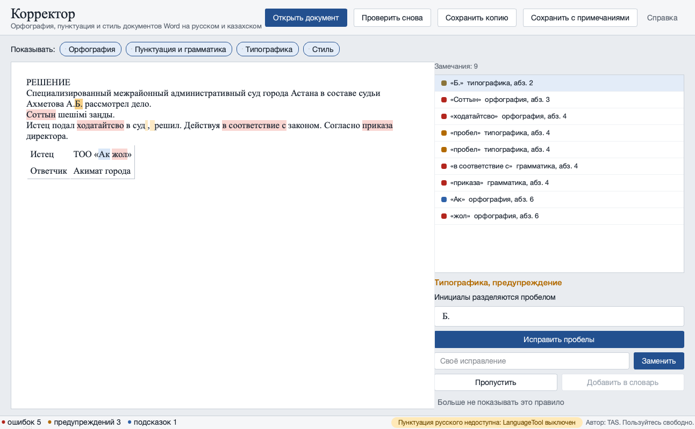

# Корректор

Проверка орфографии, пунктуации и стиля документов Word на русском и казахском языках — для судебных актов
и другой юридической переписки. Работает на Windows с флешки или из папки: без установки, без прав администратора,
без интернета. Оригинальный файл никогда не меняется: исправления вносятся в копию `имя_проверено.docx`,
оставшиеся замечания можно вынести примечаниями Word на поля.

## Скачать

Готовая сборка для Windows x64 — в разделе [Releases](https://github.com/aslantuk-bit/corrector/releases/latest):
архив `korrektor-<версия>-win64.zip` (около 205 МБ, внутри переносная Java и LanguageTool). Распаковать, папку
«Корректор» скопировать на флешку или рабочий стол, запустить `Корректор.exe`. Инструкция — в файле
`ИНСТРУКЦИЯ.txt` рядом с программой и по кнопке «Справка» в окне.

## Что проверяется

- Русский: орфография, пунктуация, грамматика и часть стиля через LanguageTool (локальный сервер на приложенной
  Java) с отключёнными шумными правилами; юридические шаблоны, где LanguageTool молчит («в соответствие с»,
  «согласно + родительный падеж», «в течении срока», запятая перед союзом).
- Казахский: орфография по словарю hunspell-kk (131 тысяча основ) с юридическим лексиконом из корпуса актов,
  запятые при союзах и вводных словах, дефисы в числительных и аббревиатурах.
- Общее: типографика (пробелы, кавычки, тире, сокращения, инициалы), смешанные алфавиты, повторы,
  длинные предложения, разнобой имён в документе, официальные названия органов и законов.
- Каталог правил с примерами, которые одновременно служат тестами: [docs/rules-ru.md](docs/rules-ru.md),
  [docs/rules-kk.md](docs/rules-kk.md). Шум правил измеряется прогоном по выборке актов: [docs/corpus-report.md](docs/corpus-report.md).

## Файлы для пользователей

Рядом с программой: `словарь.txt` (слова и фразы, которые не считаются ошибками — их же добавляет кнопка
«Добавить в словарь»), `правила.yaml` (свои правила «найти → заменить → сообщение»), `настройки.json`.
Все три можно править в Блокноте и передавать коллегам.

## Разработка

Python 3.13, PySide6, python-docx, spylls, pymorphy3, kazsearch; LanguageTool и Temurin JRE скачиваются по
`sborka/artifacts.lock` с контрольными суммами. Окружение на Mac: `tools/dev_setup.sh`, тесты: `.venv/bin/python -m pytest -q`.
Командная строка: `python -m corrector --check файл.docx --report`. Окно: `python -m corrector.app`.
Сборка для Windows — GitHub Actions (`.github/workflows/windows.yml`): тесты, PyInstaller, папка поставки, сквозная
проверка образца командной строкой и окном без экрана, релиз по тэгу `v*`. Спецификация и планы —
в `docs/superpowers/`. Провенанс словарей — `data/ИСТОЧНИКИ.md`, лицензии сторонних частей — `sborka/ЛИЦЕНЗИИ/`.

## Автор и лицензия

TAS. Пользуйтесь свободно: код распространяется по лицензии MIT (файл `LICENSE`). Сторонние словари и LanguageTool
остаются под своими лицензиями — см. `sborka/ЛИЦЕНЗИИ/ЧИТАТЬ.txt`.
